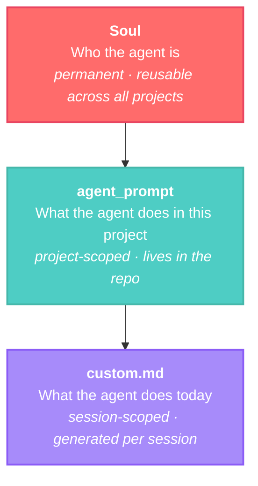
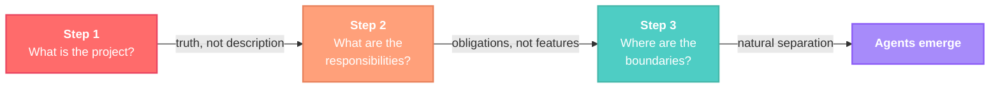
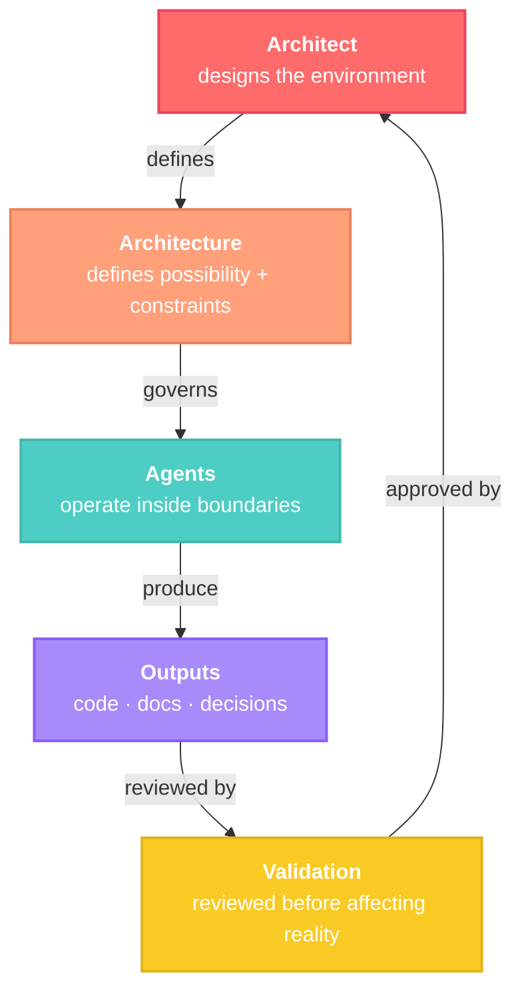
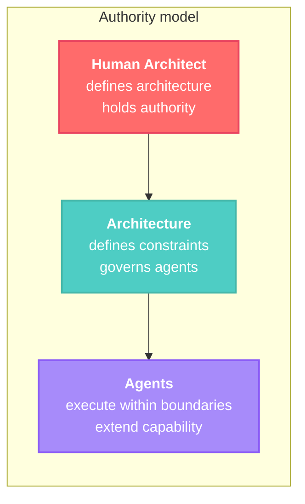
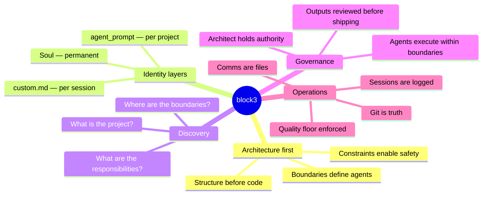

# block3

**Architecture-driven software development with intelligent agents.**

block3 is a method for building software where architecture comes first and implementation follows. Intelligent agents operate inside intentionally designed structures — they don't choose their scope, it emerges from the system's natural boundaries. The human Architect designs the environment. The agents execute within it.

> block3 does not optimize for speed. It optimizes for structural clarity.

---

## Why block3 exists

Software is entering a phase where generation is increasingly accessible, but structure remains the element that determines how far systems can evolve. Throughout computing history, progress has emerged when the primary level of work shifted upward:

```
hardware wiring → programming → languages → frameworks → platforms → orchestration
```

Another transition is unfolding — one where **architecture becomes the primary interface** through which software is shaped, and implementation becomes a downstream expression of that design.

block3 exists to explore that shift deliberately, through real systems operating under real conditions.

---

## The identity architecture

Every agent in block3 is defined through three layers. This separation is the operational core of the method.



| Layer | Scope | Answers | Lifespan |
|-------|-------|---------|----------|
| **Soul** | Identity, values, behavioral constants | *Who am I? What do I never compromise on?* | Permanent — carries across projects |
| **agent_prompt** | Stack, scope, rules, communication contracts | *What is my scope here? What can I touch?* | Per project — lives in the repo |
| **custom.md** | Current task, project state, session goals | *What do I do today?* | Per session — generated before each session |

A soul refined on one project carries its identity into the next. The expertise accumulates in the soul. The project context stays clean in the agent_prompt. The session stays focused in the custom.md.

---

## The discovery process

Agents are not chosen from a list. They are **discovered** from the project's natural boundaries.

Before any agent is defined, the Architect guides the project through three fundamental questions. The answers reveal the system's natural structure. Those boundaries become agents.



**Step 1 — What is the project?** Not the technical description. The truth. What problem are you solving? Who uses it? What is the core loop? What is out of scope?

**Step 2 — What are the responsibilities?** Not features. Obligations. What must always be true? What changes often versus rarely? What could fail independently?

**Step 3 — Where are the boundaries?** This is where agents emerge. What talks to the outside world? What stays internal? What should never be mixed? Where would you be afraid to touch without breaking something else?

The full process is documented in [`method/discovery.md`](method/discovery.md).

---

## How it runs



### Operational principles

- **Git is the source of truth.** Everything committed. Every decision traceable.
- **Inter-agent communication is files.** Markdown in the repo. Async, readable, auditable by any human at any time. No live connections between agents.
- **Sovereignty.** What ships belongs to the Architect. Real code, real git, real infrastructure. No platform between you and what you build.
- **Session logs are first-class citizens.** Every session produces a log. The system watches itself build.
- **Quality floor.** A minimum standard below which nothing ships. Defined before work begins.

---

## Governance

block3 does not remove human responsibility. It formalizes it.



> Authority does not belong to the agents. Authority belongs to the architecture, and the architecture is defined by humans.

Agents extend what can be done. Architects remain accountable for what is done. block3 is not an autonomous system. It is a governed system.

---

## Get started

### Builders — start a project

Open a Claude Code session in this repo and type: **"let's start"**

The agent reads [`start.md`](start.md) and guides you through discovery. By the end, you have:
- A clear project definition
- Natural boundaries identified
- A first set of souls drafted
- A repo structure ready to scaffold

### Readers — understand the method

| Document | What it covers |
|----------|---------------|
| [`method/discovery.md`](method/discovery.md) | The 3-step discovery process in full |
| [`method/comms.md`](method/comms.md) | Inter-agent communication protocol |
| [`method/sessions.md`](method/sessions.md) | Session log format and conventions |
| [`method/quality-floor.md`](method/quality-floor.md) | The minimum standard |

---

## Repository structure

```
block3-method/
├── README.md               ← you are here
├── start.md                ← interactive entry point — guided discovery
├── method/
│   ├── discovery.md        ← the 3-step process
│   ├── comms.md            ← inter-agent communication protocol
│   ├── sessions.md         ← session log format
│   └── quality-floor.md    ← minimum standard definition
└── souls/
    ├── master.md           ← the Architect's soul
    └── _template.md        ← blank soul structure for your agents
```

Souls are not pre-stocked. The `souls/` directory contains the Architect's reference soul and a blank template. Your agents emerge from discovery — not from a catalog.

---

## Core concepts at a glance



---

## License

MIT

---

> Strong architecture produces systems that remain clear as they grow.
> Thoughtful design produces systems that remain stable as they change.
